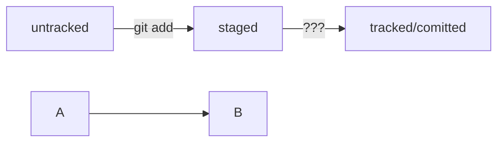

Навигация
pwd (от англ. print working directory, «показать рабочую папку») — покажи, в какой я папке;
ls (от англ. list directory contents, «отобразить содержимое директории») — покажи файлы и папки в текущей папке;
ls -a — покажи также скрытые файлы и папки, названия которых начинаются с символа .;
cd first-project (от англ. change directory, «сменить директорию») — перейди в папку first-project;
cd first-project/html — перейди в папку html, которая находится в папке first-project;
cd .. — перейди на уровень выше, в родительскую папку;
cd ~ — перейди в домашнюю директорию (/Users/Username);
cd / — перейди в корневую директорию.

Работа с файлами и папками
Создание
touch index.html (англ. touch, «коснуться») — создай файл index.html в текущей папке;
touch index.html style.css script.js — если нужно создать сразу несколько файлов, можно напечатать их имена в одну строку через пробел;
mkdir second-project (от англ. make directory, «создать директорию») — создай папку с именем second-project в текущей папке.

Копирование и перемещение
cp file.txt ~/my-dir (от англ. copy, «копировать») — скопируй файл в другое место;
mv file.txt ~/my-dir (от англ. move, «переместить») — перемести файл или папку в другое место.

Чтение
cat file.txt (от англ. concatenate and print, «объединить и распечатать») — распечатай содержимое текстового файла file.txt.

Удаление
rm about.html (от англ. remove, «удалить») — удали файл about.html;
rmdir images (от англ. remove directory, «удалить директорию») — удали папку images;
rm -r second-project (от англ. remove, «удалить» + recursive, «рекурсивный») — удали папку second-project и всё, что она содержит.

Полезные возможности
Команды необязательно печатать и выполнять по очереди. Можно указать их списком — разделить двумя амперсандами (&&).
У консоли есть собственная память — буфер с несколькими последними командами. По ним можно перемещаться с помощью клавиш со стрелками вверх (↑) и вниз (↓).rm
Чтобы не вводить название файла или папки полностью, можно набрать первые символы имени и дважды нажать Tab. Если файл или папка есть в текущей директории, командная строка допишет путь сама.
Например, вы находитесь в папке dev. Начните вводить cd first и дважды нажмите Tab. Если папка first-project есть внутри dev, командная строка автоматически подставит её имя. Останется только нажать Enter.

Работа в Git:
git init - инициализация репозитория
rm -rf .git - "разгитить" папку - т.е. безвозвратно удалить скрытую папку .git, в которой хранится служебная информация
git add (название файла или -all или .) - добавить файл в репозиторий
git status - узнать статус файлов в папке (добавлены или не добавлены в репозиторий, закоммичены или нет = актуальна ли версия)
git commit -m "комментарий для коммита"

git log - посмотреть историю коммитов

ls -la .ssh/ Эта команда покажет содержимое папки .ssh в виде списка файлов.
ls -a ~/.ssh Эта команда покажет содержимое папки .ssh.
ssh-keygen -t ed25519 -C "электронная почта, к которой привязан ваш аккаунт на GitHub" - генерация ssh ключа с алгоритмом шифрования ed25519
ssh-keygen -t rsa -b 4096 -C "электронная почта, к которой привязан ваш аккаунт на GitHub" - генерация ssh ключа с алгоритмом шифрования 4096

Связывание ssh ключа и репозитория:
# скопировать содержимое ключа в буфер обмена:
$ clip < ~/.ssh/id_rsa.pub
# для ed25519:
$ clip < ~/.ssh/id_ed25519.pub 

Cвязать локальный и удаленный репозиторий:
$ cd ~/dev/first-project
$ git remote add origin git@github.com:%ИМЯ_АККАУНТА%/first-project.git - ссылка с SSH гитхаба

Проверить, что репозитории связаны:
$ git remote -v
origin    git@github.com:%ИМЯ_АККАУНТА%/%ИМЯ-ПРОЕКТА%.git (fetch)
origin    git@github.com:%ИМЯ_АККАУНТА%/%ИМЯ-ПРОЕКТА%.git (push) 

Первый пуш:
$ git push -u origin main # Если команда приведёт к ошибке, попробуйте 
                          # заменить main на master. 
						  
Следующие пуши:
$ git push 

